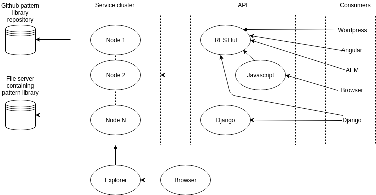
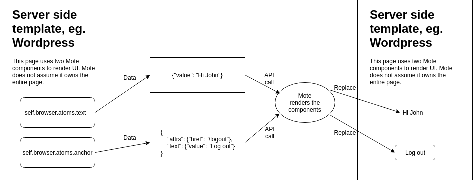

.. mote documentation master file, created by
   sphinx-quickstart on Mon Oct 31 16:01:21 2016.
   You can adapt this file completely to your liking, but it should at least
   contain the root `toctree` directive.

Welcome to Mote's documentation!
================================

Mote is a data driven pattern library framework and continuous UI delivery service.
It allows non-engineers to collaborate on creating pattern libraries, and to
serve these patterns over an API directly to a web or mobile site.

Architecture
------------

Mote itself never stores any data - rather, everything is inferred from a directory
structure and metadata files where applicable. This makes it possible to store pattern
libraries across a wide range of external systems like Github and even a plain file
server.

Its aim is to deliver UI to as many external systems as possible by adhering to
existing standards.

Rendering
---------

Server side
***********

Mote supports native server side rendering for Django sites because Mote itself
is written in Django. Non-Django systems, like Wordpress, can use Mote to
render and deliver components over a RESTful API.

Client side
***********

Mote supports client side rendering, typically from static HTML files loaded into
a browser. In this case the Javascript API is the most efficient method to access
Mote services.

.. toctree::
   :maxdepth: 2

   gettingstarted
   pattern
   metadata
   multiple-mote-projects
   advanced-mote
   api
